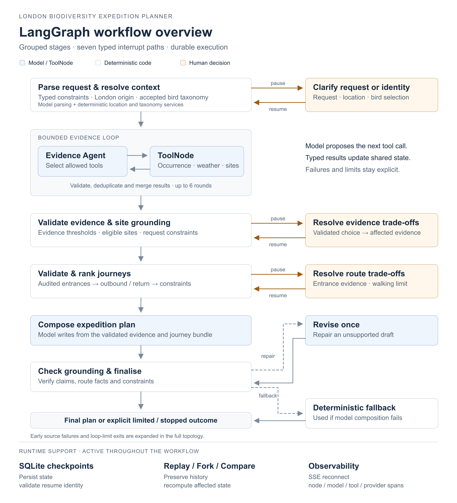

# London Biodiversity Expedition Planner

**A full-stack LangGraph case study in stateful orchestration, typed human-in-the-loop workflows, durable execution and agent observability.**

It turns a natural-language London birdwatching request into an evidence-grounded, route-validated field plan—or stops safely when the available evidence or constraints cannot support one.

London-only · birds-first · English-only · historical evidence, not a sighting prediction

[See the demo](#demo) · [Engineering highlights](#engineering-highlights) · [Run it locally](#quick-start) · [Explore the architecture](#architecture-and-core-workflow)

## Demo

[](https://youtu.be/yD1BQRdGDL4)

**[▶ Watch the full walkthrough on YouTube](https://youtu.be/yD1BQRdGDL4)**

Recorded in `live/live` mode, the walkthrough uses a live model and live upstream API requests. It follows one expedition from its original natural-language request through graph execution, a typed human decision, the evidence map and the validated journey. It then demonstrates checkpoint replay, branching and deterministic comparison without overwriting the original result.

## Engineering highlights

| Capability | What this project implements |
| --- | --- |
| Stateful orchestration | A typed LangGraph state, explicit reducers, conditional routing and a bounded ToolNode evidence loop |
| Typed human-in-the-loop | Seven interrupt paths for incomplete requests, ambiguous locations or taxa, evidence trade-offs and route decisions |
| Durable execution | SQLite-backed checkpoints with exact thread, branch, execution and checkpoint identities |
| Time travel | Resume, replay, fork, targeted downstream invalidation and deterministic plan comparison |
| Observability | Reconnectable SSE events plus node, model, tool and routing-provider timing spans |
| Reliability | Deterministic evidence and routing authority, grounded model revision and a complete safe fallback |
| Full-stack delivery | FastAPI and Pydantic on the backend; React, TypeScript, generated OpenAPI types and MapLibre in the browser |

The model may parse a request, choose from an allow-listed set of evidence tools and compose an explanation. Deterministic code owns the London boundary, taxonomy acceptance, evidence thresholds, site grounding, entrance eligibility, route constraints, route ranking, provenance and final safety checks.

## Does it actually work?

The [video walkthrough](#demo) demonstrates `live/live` execution. For a stable result you can reproduce without model or routing API keys, use the `fixture/scripted` example below.

### Reproducible end-to-end example

The following result was reproduced in `fixture/scripted` mode, which uses versioned data and deterministic scripted model responses:

```text
Request
Plan a two-hour expedition from SW11 4NJ on 15 June 2026
to look for Common woodpigeon.

Result
✓ London location and bird taxonomy resolved
✓ Strong historical-evidence gate passed
✓ 8 evidence-grounded candidate sites retained
✓ Kensington Gardens selected via the mapped Palace Gate entrance
✓ 7.85 km validated return walk · 105 minutes travel
✓ 15 minutes of the two-hour outing remain for field observation
```

The result is not a claim that a bird will be seen. It demonstrates that the workflow can reach a complete plan only after its evidence, grounding, entrance and journey constraints pass.

Automated checks cover backend behaviour, HITL, checkpoint forking, basemap failure and mobile layout. See [verification commands and CI coverage](docs/verification.md).

## Quick Start

The default `fixture/scripted` demonstration needs **no OpenAI or routing API key**. It runs the graph, HITL, checkpoint history and UI using versioned data and scripted model responses. Live model calls are opt-in.

Both options below start your own local backend and frontend. Downloads and the default OpenFreeMap basemap need internet access; the fixture workflow makes no live biodiversity, geocoding, weather, routing or model requests. Set `BIODIVERSITY_BASEMAP_STYLE_URL=disabled` in the backend environment to use the overlay-only map.

### Get the code

```bash
git clone https://github.com/ttteein-max/london-biodiversity-expedition.git
cd london-biodiversity-expedition
```

You need repository read access while this repository is private. Alternatively, download and extract the ZIP, then open a terminal in the extracted directory containing `README.md`, `requirements.txt` and `frontend/`.

Choose **one** of the following options.

### Option A: single-container demo

Install and start Docker with Docker Compose support. From the repository root:

```bash
docker compose up --build
```

Once startup completes, open [http://127.0.0.1:8080](http://127.0.0.1:8080), select **Strong evidence**, then choose **Start expedition**. Docker builds and serves the frontend and API together; you do not need Python or Node installed on the host.

The supplied Compose configuration permits only `fixture/scripted`. It does not forward OpenAI keys from your shell or `.env` into the container. Use Option B for live models. See the [deployment guide](docs/phase-4-public-demo.md) for persistence, retention and public-demo limits.

### Option B: local development

Use **Python 3.12 or 3.13** and **Node.js 22.13+**. Python 3.11 is the current minimum; Python 3.10 cannot run the current code and dependencies. If using Node 20, use 20.19 or later. The commands below use macOS/Linux shell syntax and start from the repository root.

```bash
python3 -m venv .venv
source .venv/bin/activate
python -m pip install --upgrade pip
python -m pip install -r requirements.txt

cd frontend
npm ci
cd ..
```

On Windows PowerShell, use `py -3.13 -m venv .venv` and `.venv\Scripts\Activate.ps1` for the first two commands; the remaining commands are the same. Confirm the selected Python version before installing dependencies.

In **terminal 1**, with the virtual environment active and the working directory at the repository root, start the API and leave it running:

```bash
python -m uvicorn app.biodiversity.api.main:app --host 127.0.0.1 --port 8000
```

In **terminal 2**, open the same repository root, then start the frontend and leave it running:

```bash
cd frontend
npm run dev
```

Open [http://127.0.0.1:5173](http://127.0.0.1:5173), keep **Run mode → fixture/scripted**, select **Strong evidence**, then choose **Start expedition**. The Vite development server forwards `/api` requests to your local API on port 8000.

If the page opens but cannot load or start a run, check [the API health endpoint](http://127.0.0.1:8000/api/v1/health) and terminal 1. Both processes must remain running. If Vite reports a different port because 5173 is occupied, free port 5173 or explicitly update the backend CORS configuration.

### Optional: use your own OpenAI API key

Skip this section for the default demo. In Option B, stop the API, create a local `.env` by copying [.env.example](.env.example), and edit these values in that file. Use your own API key and a model available to your API project that supports tool calling and structured output; the repository does not supply a model ID or a shared key.

```dotenv
OPENAI_API_KEY=replace-with-your-own-api-key
OPENAI_MODEL=replace-with-your-accessible-model-id
```

For OpenAI directly, leave `OPENAI_BASE_URL` unset; the backend defaults to `https://api.openai.com/v1`. A custom endpoint is optional and must support the model interfaces this application uses.

Restart the API from the repository root, with the virtual environment active, using:

```bash
python -m uvicorn app.biodiversity.api.main:app --env-file .env --host 127.0.0.1 --port 8000
```

**A `.env` file alone is not loaded automatically.** The explicit `--env-file` flag loads it for the backend; exported shell variables are also supported and take precedence. Keep credentials in the backend: `.env` is gitignored and excluded from Docker builds. Never put keys in frontend code or a `VITE_` variable.

Then choose **fixture/live** to exercise the live model against stable evidence, or **live/live** for current upstream data as well. Without valid live-model configuration, selecting either mode fails; there is no fallback to the author's credentials.

| Run mode | Data and routing | Model | OpenAI API usage |
| --- | --- | --- | --- |
| `fixture/scripted` | Versioned fixtures | Scripted responses | None |
| `live/scripted` | Live upstream services | Scripted responses | None |
| `fixture/live` | Versioned fixtures | Configured live model | Charged to the API project used by your backend |
| `live/live` | Live upstream services | Configured live model | Charged to the API project used by your backend |

## Architecture and core workflow

LangGraph fits this workflow because each new piece of evidence can change what happens next: an incomplete request needs clarification, ambiguous taxa need a human choice, weak evidence may require another tool call, and a proposed journey may fail its constraints. Typed state and reducers preserve what has been learned; conditional edges, bounded tool loops and interrupts make those decisions explicit.

SQLite checkpoints let the graph pause for a person and continue later, or restore a prior state for replay and comparison. The application adds branch and execution identities, validates human updates and exposes graph events to the frontend. These mechanisms support the workflow shown below.

[](https://github.com/ttteein-max/london-biodiversity-expedition/raw/refs/heads/main/docs/diagrams/langgraph-overview.png)

[Explore the complete LangGraph topology](docs/langgraph-architecture.md)

*The overview groups related steps for readability. The [complete topology](docs/langgraph-architecture.md) preserves all 29 workflow nodes, START/END and 50 compiled edges. Click either diagram to open its full-resolution image directly.*

One successful run moves through eight conceptual stages:

1. **Request intake** — a structured-output model extracts the location, bird, date, duration and optional constraints.
2. **London location** — deterministic postcode or named-place services validate a generalised planning origin inside Greater London.
3. **Bird taxonomy** — GBIF taxonomy resolution accepts one Aves species or pauses for a safe human choice.
4. **Evidence loop** — the model selects only registered tools; occurrence, weather and public-site results are typed, deduplicated and merged into graph state.
5. **Deterministic validation** — code applies evidence-quality thresholds, privacy rules, site-to-cell grounding and request constraints.
6. **Entrances and journeys** — only directly grounded sites with audited OSM entrances reach the route provider; outbound and return journeys are requested separately.
7. **Plan composition** — the model receives a compact validated bundle and writes the user-facing plan without choosing or recalculating route facts.
8. **Grounding and finalisation** — deterministic checks either accept the draft, request one bounded revision or emit a complete fallback plan.

The browser obtains its topology from the compiled backend graph. It does not maintain a second handwritten version of the workflow.

## Human-in-the-loop, durability and time travel

HITL is used only when a person can resolve a real ambiguity or make an actionable trade-off. It is not inserted after every model response.

### Typed decision points

| Interrupt | Human decision |
| --- | --- |
| Request clarification | Supply a missing or contradictory request field |
| Location correction | Select a verified London place candidate or provide a postcode |
| Taxonomy selection | Select one accepted taxon from the offered candidates |
| Bird input correction | Correct the original bird name when taxonomy resolution fails |
| Evidence trade-off | Expand the search radius or seasonal window, consider a related taxon, or accept a limited outcome |
| Related taxon selection | Confirm a validated related taxon before evidence is recomputed |
| Route trade-off | Accept uncertain entrance evidence, raise a walking limit, or finish without a fabricated route |

Every response is checked against the exact thread, checkpoint, branch, execution, interrupt kind and offered option before the graph resumes. Raw arbitrary state edits are not accepted from the browser.

### Durable run model

```text
Thread      one expedition across its complete history
└── Branch  one constraint trajectory
    └── Execution  one run or replay of that trajectory
        └── Checkpoint  one persisted graph state after a step
```

- **Resume** continues the pending execution after a validated human decision.
- **Replay** creates a new execution on the same branch, restoring a historical non-terminal checkpoint and continuing its downstream work.
- **Fork** creates a new branch with an allow-listed constraint update and recomputes invalidated evidence.
- **Compare** produces server-calculated differences in selected plan and constraint fields between two exact checkpoints.

## Observability

The product exposes agent execution as a first-class interface, not as console output added after development.

- Every node, model call, tool call, routing-provider attempt and saved checkpoint emits a sequence-numbered lifecycle event.
- Server-Sent Events stream progress to the browser and replay missed events after reconnect without cancelling the underlying run.
- The UI overlays live and persisted execution state on the actual compiled LangGraph topology.
- Checkpoint inspection uses allow-listed views rather than serialising raw LangGraph state.
- Timing reports separate node wall time from nested model, tool and provider spans, making the slowest stage visible.
- Safe operation reports preserve tool audits, timings, plan facts and route decisions without API keys, raw provider requests, individual occurrence locations or private route geometry.

For the [recorded Phase 5 fixture run](reports/phase5-verification.md#offline-fixture-timing-sample), the timing report captured 98 events and 33 timed spans across nodes, models, tools and routing-provider calls. The slowest nested work was the public green-space lookup, while all four fixture provider attempts completed in 1.23 ms combined. These measurements are diagnostic samples, not performance guarantees.
