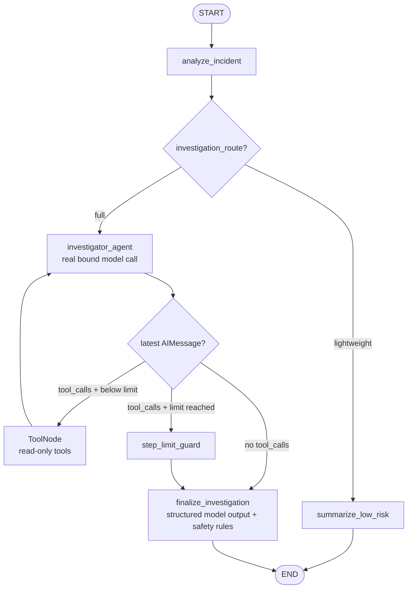

# Agent Control Studio

Phase 1.2 combines a deterministic outer LangGraph workflow with a dynamic,
LLM-driven read-only investigator agent. No action is executed: recovery actions
are validated proposals only.

## Architecture



The outer workflow remains deterministic:

- Classification selects `lightweight` or `full`.
- Lightweight incidents never call an LLM or tool.
- Full incidents enter the investigator loop.
- Finalization and action safety always happen before `END`.

Inside the full branch, the investigator model dynamically decides:

- Which read-only tool to call.
- The tool arguments.
- Tool order.
- Whether another tool is needed.
- When to stop calling tools.

The available tools are:

- `query_service_metrics`
- `search_service_logs`
- `list_recent_deployments`

They use deterministic seeded local data; there are no real monitoring or cloud
connections in Phase 1.2.

## State and ToolNode

`IncidentState` preserves the Phase 1.1 classification, evidence, action, audit,
streaming, and checkpoint fields. It now also contains:

- `messages`, using LangGraph's `add_messages` reducer.
- `agent_steps`.
- `step_limit_reached`.

The production investigator node calls a model bound with the three tools and
returns the real `AIMessage`. When that message contains tool calls, the official
LangGraph `ToolNode` executes them.

Each tool reads `ToolRuntime.tool_call_id` and returns a `Command` that appends:

- A structured `EvidenceItem`.
- The executed tool audit name.
- A matching `ToolMessage` containing JSON tool output.
- A `tool_errors` entry when seeded data is unavailable.

Unexpected errors still surface. `ToolDataUnavailable` is an expected observation
returned to the model so it can make another decision.

## Finalization safety

The finalizer model returns a validated `FinalInvestigation` containing:

- `diagnosis`
- `diagnosis_confidence`
- `investigation_status`
- `ProposedAction`

Deterministic post-model checks enforce:

- Rollback requires successful deployment evidence.
- The proposed service must match the classified service.
- `target_version` must match a recorded `previous_version`.
- Step-limit and unsupported rollback results become safe escalation proposals.
- Actions are proposed but never executed.

## Installation

Python 3.10 or newer is required.

```bash
python -m venv .venv
source .venv/bin/activate
python -m pip install --upgrade pip
python -m pip install -r requirements.txt
```

## Scripted mode

Scripted mode is deterministic, offline, and requires no key. Its fixture emits
predefined test-only `AIMessage.tool_calls` so the real Graph/ToolNode loop can be
exercised reliably.

```bash
python -m scripts.run_agent \
  "checkout failures increased after a deployment" \
  --mode scripted
```

The previous CLI remains as a scripted compatibility entry point:

```bash
python -m scripts.run_workflow \
  "checkout failures increased after a deployment"
```

## Live mode

Never put a key in source code. If a key has been posted in chat or logs, revoke
it and issue a new one before continuing.

```bash
export OPENAI_API_KEY="replace-with-your-key"
export OPENAI_MODEL="gpt-5.6-luna"
export OPENAI_BASE_URL="https://api.openai-proxy.org/v1"

python -m scripts.run_agent \
  "checkout failures increased after a deployment" \
  --mode live
```

`OPENAI_BASE_URL` is optional; omit it for the official OpenAI endpoint.
The Phase 1.2 example selects `gpt-5.6-luna`, while production code still reads
`OPENAI_MODEL` from the environment so the model remains overridable. The proxy
must expose that exact model ID.

`langchain-openai` uses the OpenAI-compatible API protocol. A proxy may expose
GPT, Claude, Gemini, or other providers under that protocol, but a model is usable
here only if that proxy supports both Chat Completions-compatible tool calling and
structured output for its exact model ID. Provider brand names are not themselves
interchangeable model IDs.

The finalizer currently uses structured output through function calling for broad
OpenAI-compatible support.

## Tests

The default suite is fully offline and never reads `OPENAI_API_KEY`:

```bash
python -m pytest -q
```

It verifies:

1. A scripted model selects metrics, deployments, and logs before stopping.
2. The model can stop after only a subset of tools.
3. Tool order follows model output rather than fixed graph edges.
4. Low-risk incidents use neither model nor tools.
5. Tool errors return to the model before its next decision.
6. The maximum-step guard terminates a continuing tool loop.
7. `ProposedAction` validation.
8. Rollback rejection without deployment evidence.
9. Alternating investigator and ToolNode streaming events.
10. Checkpointer restoration with the same `thread_id`.
11. Production-source AST checks for fabricated AI tool calls.
12. Deterministic outer routing.

## Streaming interfaces for Phase 2

The compiled graph remains directly consumable through LangGraph streaming:

```python
for event in graph.stream(
    {"incident_description": incident},
    config={"configurable": {"thread_id": thread_id}},
    stream_mode="updates",
    version="v2",
):
    ...
```

Phase 2 can map these node updates to visual states:

- `analyze_incident`
- `summarize_low_risk`
- `investigator_agent`
- `tools`
- `step_limit_guard`
- `finalize_investigation`

It can additionally use `messages` mode for live model tokens and `checkpoints`
or `tasks` mode for execution diagnostics. No FastAPI or SSE server is introduced
in this phase.

An experimental async compatibility adapter also consumes LangGraph v3 event
streaming without changing the graph:

```python
from app.streaming import astream_agent_run_events

async for event in astream_agent_run_events(graph, graph_input, config):
    print(event.model_dump(mode="json"))
```

The adapter calls `graph.astream_events(..., version="v3")` and maps internal
message, tool, and node events into the application-owned `AgentRunEvent` schema.
Raw LangGraph protocol events are deliberately not part of the future frontend
contract. Phase 2 can serialize each `AgentRunEvent` as one SSE `data:` record.

## Persistence boundary

The graph still supports `InMemorySaver`, `thread_id`, `get_state()`, and
`get_state_history()`. State survives across graph objects sharing the same saver,
but not across Python process restarts. Database-backed persistence remains out of
scope.

## Official references

- [LangGraph quickstart](https://docs.langchain.com/oss/python/langgraph/quickstart)
- [Workflows and agents](https://docs.langchain.com/oss/python/langgraph/workflows-agents)
- [Thinking in LangGraph](https://docs.langchain.com/oss/python/langgraph/thinking-in-langgraph)
- [Use the Graph API](https://docs.langchain.com/oss/python/langgraph/use-graph-api)
- [Testing LangGraph](https://docs.langchain.com/oss/python/langgraph/test)
- [LangGraph event streaming](https://docs.langchain.com/oss/python/langgraph/event-streaming)
