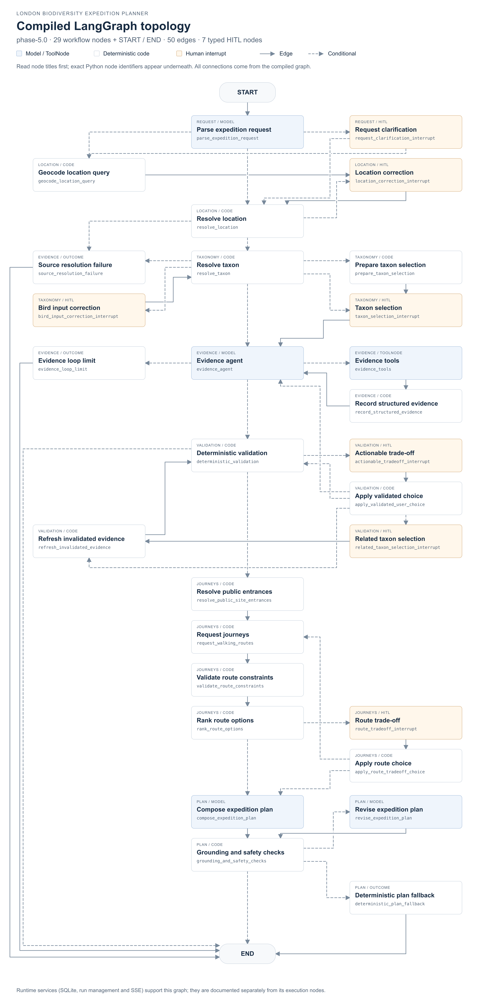

# LangGraph architecture

[Back to the README overview](../README.md#architecture-and-core-workflow) · [Open full-size topology PNG](https://github.com/ttteein-max/london-biodiversity-expedition/raw/refs/heads/main/docs/diagrams/langgraph-topology.png) · [Topology SVG](https://github.com/ttteein-max/london-biodiversity-expedition/raw/refs/heads/main/docs/diagrams/langgraph-topology.svg)

The README introduces the workflow as grouped stages. This diagram expands those stages into the current `phase-5.0` graph: **29 workflow nodes, START/END, 50 edges and seven typed HITL nodes**.

## Complete compiled topology

## What the overview groups together

| README stage | Expanded implementation |
| --- | --- |
| Parse request & resolve context | Structured request parsing; request clarification; named-place geocoding; London validation; taxonomy resolution, previews and corrections |
| Bounded evidence loop | `evidence_agent` → `evidence_tools` → `record_structured_evidence` → `evidence_agent`, with an explicit loop-limit exit |
| Validate evidence & site grounding | Deterministic evidence gates; typed trade-offs; validated choices; related-taxon selection and affected-evidence refresh |
| Validate & rank journeys | Public-site entrances; bounded provider requests; route constraints; deterministic ranking; route HITL and validated route choices |
| Compose expedition plan | Model composition from the validated evidence and journey bundle |
| Check grounding & finalise | Deterministic checks; at most one model revision; a complete deterministic fallback when required |

`request_walking_routes` retains its existing Python identifier. Its current user-facing label is **Request journeys**: live routing defaults to TfL public transport plus walking, while the reproducible fixture uses walking routes. The diagram does not imply that every live journey is walking-only.

The seven human interrupt nodes are:

1. `request_clarification_interrupt`
2. `location_correction_interrupt`
3. `taxon_selection_interrupt`
4. `bird_input_correction_interrupt`
5. `actionable_tradeoff_interrupt`
6. `related_taxon_selection_interrupt`
7. `route_tradeoff_interrupt`

Each decision resumes only after its payload and exact run/checkpoint identity have been validated. The overview groups these seven nodes into request/identity, evidence and journey decision areas.

## Runtime support

These services support the workflow throughout execution. They are shown beneath the README overview and are not additional nodes in the compiled topology.

| Capability | Implementation and role |
| --- | --- |
| Typed state and reducers | [BiodiversityAgentState](../app/biodiversity/graph/state.py) holds request, evidence, plan and execution lineage; reducers control how updates merge |
| Durable checkpoints | [SQLite checkpoint lifecycle](../app/biodiversity/graph/checkpoint.py) persists graph state; tests can use an in-memory saver |
| Resume, replay, fork and compare | [Run management](../app/biodiversity/runs.py) validates identity and compatibility, preserves recorded history and applies targeted invalidation |
| Observability | [Lifecycle events and timing spans](../app/biodiversity/observability.py) cover nodes, models, tools, providers and checkpoints; the API streams ordered events and replays missed events on reconnect |

The browser also reads its topology from [the compiled-graph presentation service](../app/biodiversity/api/services/topology.py). For more detail, see [durable HITL and time travel](phase-3-hitl-time-travel.md) and [geospatial routing](phase-5-geospatial-routing.md).
