# Phase 3 HITL persistence and time travel

Phase 3 makes the London biodiversity graph resumable across Python processes and adds application-owned checkpoint history, replay, fork and deterministic plan comparison. Phase 1 remains authoritative for taxonomy acceptance, historical-evidence classification, privacy, safe-map eligibility, public-site grounding, constraints and candidate-plan readiness.

The workflow remains London-only, English-only and birds-first. Historical occurrence evidence is not a sighting probability, and record counts are not abundance or population estimates.

## Architecture

The editable Mermaid source is in
`docs/diagrams/phase-3-biodiversity-langgraph.mmd`. The rendered diagram uses
separate colours and line styles for graph nodes, HITL nodes, ToolNode internals,
state, reducers, checkpointing, streaming, cycles and the external time-travel
management layer.



## Durable checkpointer lifecycle

`create_biodiversity_checkpointer()` still returns an isolated `InMemorySaver` for unit tests. Terminal workflows use `open_biodiversity_sqlite_checkpointer(path)`, a context manager around the official `langgraph-checkpoint-sqlite` `SqliteSaver`.

```python
with open_biodiversity_sqlite_checkpointer(
    "data/runtime/biodiversity-checkpoints.sqlite"
) as checkpointer:
    graph = build_biodiversity_graph(..., checkpointer=checkpointer)
    graph.invoke(input_state, {"configurable": {"thread_id": "expedition-1"}})
```

The connection remains open while the graph is compiled and used, commits on successful exit and always closes. The database path is injectable, and tests use `tmp_path`. SQLite, WAL and SHM files are ignored and are never committed.

The default path is resolved from the repository root rather than the caller's current working directory. A 30-second SQLite busy timeout avoids immediate `database is locked` failures for brief local CLI overlap; SQLite is still not used as a multi-instance service.

The serializer disables pickle fallback and sets JSON and msgpack module allowlists to strict mode. Checkpoint state therefore uses JSON dictionaries plus LangGraph/LangChain's known safe built-in message types; arbitrary Python modules cannot be revived from the database.

SQLite is appropriate for this local portfolio/demo and synchronous CLI. It is not presented as a horizontally scaled or multi-instance production database.

## Run identifiers and branch lineage

The public contract uses typed models in `app.biodiversity.run_models`, not LangGraph `StateSnapshot`:

- `thread_id` selects the durable checkpoint namespace for one logical expedition.
- `checkpoint_id` selects one immutable historical graph state inside the thread.
- `branch_id` identifies one original or forked trajectory inside that thread.
- `execution_id` identifies one concrete execution of a branch. Replay creates a new execution ID without pretending that the user's constraints formed a new fork.
- `parent_branch_id` identifies the trajectory from which a fork was created.
- `forked_from_checkpoint_id` identifies the exact historical point selected for the fork.

`CheckpointSummary` records checkpoint and parent IDs, the application `node_id`, creation time, graph step/source, next nodes, interrupt kind, terminal status, redacted decision kinds/options and the branch's final checkpoint ID. It never returns complete decision update dictionaries. `RunBranch` records its head and final checkpoint IDs plus fork updates. Initial runs and forks remain readable by exact checkpoint ID; a fork never overwrites the original final plan.

Every new run also checkpoints a `RunManifest` containing the data mode, model mode, non-secret model identifier, a one-way endpoint fingerprint, workflow version and state-schema version. The endpoint URL and credentials themselves are not stored. Resume, replay and fork reuse that manifest. Explicitly supplying a conflicting mode, model or endpoint is rejected before graph execution, so one lineage cannot silently combine live evidence with fixture evidence or a different model runtime. Legacy checkpoints created before the manifest require both modes to be supplied explicitly.

## Safe checkpoint state views

Phase 4 must not serialise `StateSnapshot.values` to the browser. The application-owned
`StateView` is an explicit allowlist containing only safe request constraints, generalised
London/taxonomy status, aggregate evidence counts, plan status, HITL kind, counters and
redacted decision `kind/option` values. It excludes the original request, messages, raw
interrupt payloads, postcode/start coordinates, BNG coordinates, tool input/output, raw
occurrence records, occurrence IDs, HMAC references, safe-cell geometries and site-to-cell
associations.

The stable lookup key is the exact tuple:

```text
thread_id + node_id + graph_step + checkpoint_id -> StateView
```

`BiodiversityRunManager.state_view(...)` verifies that the requested node and step really
belong to the checkpoint, preventing a stale UI row from displaying another checkpoint's
state. `state_views(...)` returns newest-first allow-listed views. The CLI exposes the same
contract:

```bash
python -m scripts.manage_biodiversity_runs state-view \
  --thread-id expedition-1 \
  --node-id deterministic_validation \
  --graph-step 14 \
  --checkpoint-id CHECKPOINT_ID
```

## Live event channel and reconnect replay

Executing run-manager operations use LangGraph's official `stream_mode="checkpoints"`, so
`checkpoint_created` is published for every persisted superstep rather than inferred only
after the entire run. Events contain the safe `node_id`, `graph_step`, checkpoint/branch/
execution IDs and next-node names, never checkpoint state.

`AgentRunRecorder` accepts an `AgentRunEventSink` and publishes each already-redacted event
immediately when its sequence is assigned. `InMemoryAgentEventBroker` is the local Phase 4
SSE channel: `wait_for_events(run_id, after_sequence=...)` waits for running events or a
heartbeat timeout, while `events_after(...)` replays every retained event after the client's
last sequence. The broker is deliberately process-local; a later distributed deployment can
provide a durable sink using the same interface without changing graph callbacks.

Model events label LangChain/OpenAI client metadata as `api_adapter` and
`api_protocol="openai-compatible"`. They do not claim that `ls_provider="openai"` is the
underlying model vendor; a model such as `gemini-3.7-flash` therefore remains correctly named
while the UI separately shows the compatible adapter/protocol.

## Taxonomy HITL

Ambiguous taxonomy now passes through `prepare_taxon_selection` before `taxon_selection_interrupt`. The preparation node performs all bounded repository I/O, saves the coordinate-free result, and creates a checkpoint. The interrupt node only displays that saved payload, calls `interrupt()` and validates the resume, so resuming cannot repeat candidate API calls.

Candidate payload:

```json
{
  "kind": "taxon_selection",
  "candidate_budget": 3,
  "request_budget": 3,
  "candidates": [
    {
      "accepted_taxon_key": 2489281,
      "common_name": "Lesser Ground-robin",
      "scientific_name": "Amalocichla incerta (Salvadori, 1876)",
      "canonical_name": "Amalocichla incerta",
      "rank": "SPECIES",
      "taxonomic_status": "ACCEPTED",
      "class": null,
      "order": null,
      "family": null,
      "genus": null,
      "resolution_method": "gbif_species_search_related_common_name",
      "confidence": null,
      "evidence_preview": {
        "status": "evaluated",
        "evidence_outcome": "insufficient_evidence",
        "sampled_count": 0,
        "retained_count": 0,
        "ranking_eligible_count": 0,
        "dataset_count": 0,
        "target_months": [1, 2, 12],
        "source_status": "available",
        "limitations": [],
        "provenance_reference": "https://www.gbif.org/developer/occurrence"
      }
    }
  ],
  "resume_schema": {"accepted_taxon_key": "one listed integer key"}
}
```

Fields in the GBIF hierarchy are `null` when the upstream saved response did not provide them; the application never invents them. The preview budget evaluates at most three candidates with one page/request each. Later candidates are `not_evaluated_budget`, which is distinct from no evidence. A source error is `source_failure`, also distinct from an evaluated `insufficient_evidence` result.

Resume:

```json
{"accepted_taxon_key": 2489281}
```

Only a listed accepted key is valid. `BiodiversityRunManager.resume()` validates the resume before invoking LangGraph, so malformed or invented input cannot create a resume checkpoint or mutate the saved interrupt.

## Low-evidence HITL

The deterministic validation node separates London-wide occurrence evidence from local site grounding:

- `expand_search_radius` is offered only when strong occurrence evidence exists but no directly grounded public-site polygon exists inside the current radius. The new radius must increase and stay at or below 25 km. Only public-site evidence and downstream products are recomputed.
- `widen_seasonal_window` is offered only while the request radius is below three months. The new value must increase. Seasonal months wrap across the year boundary and the actual list appears in canonical tool audit/provenance. Occurrence evidence, safe cells, sites, constraints, bundle and plan are recomputed; location, taxonomy and exact-date weather are retained.
- `consider_related_taxa` is offered only when the bounded deterministic GBIF query saved candidates. Same-genus candidates precede same-family candidates and each payload labels its level. Selecting this option produces a second `related_taxon_selection` interrupt. A related taxon is not an ecological substitute and is not asserted to be easier to observe.
- `keep_constraints_accept_low_confidence` records the user's acknowledgement and produces a non-recommendation result with no recommended sites. The authoritative Phase 1 status remains `context_only` for limited evidence and `cannot_recommend_sites` for insufficient evidence. In both cases the final plan contains `evidence_gate_passed: false`, `low_confidence_accepted: true` and a fixed `low_confidence_notice`; the model cannot alter these fields. Contextual sites may remain.

Examples:

```json
{"option": "expand_search_radius", "search_radius_km": 8}
{"option": "widen_seasonal_window", "seasonal_window_radius_months": 2}
{"option": "consider_related_taxa"}
{"option": "keep_constraints_accept_low_confidence"}
```

The follow-up related selection uses the same accepted-key-only schema as taxonomy selection.

## Replay and fork

History comes from `graph.get_state_history(config)` and is translated to `CheckpointSummary`. Exact historical operations use the config carried by the selected history item, including its checkpoint namespace.

Replay:

```python
historical = selected_history_snapshot
graph.invoke(None, historical.config)
```

The run manager uses the streaming equivalent with the same `None` input and exact historical
config so it can publish each checkpoint while preserving official replay semantics.

Replay re-executes nodes after the selected checkpoint. API, model and interrupt nodes after that point can run again. A terminal checkpoint has no downstream node, so replay rejects it and asks the caller to select an earlier checkpoint instead of manufacturing an execution with no checkpoint. A new `execution_id` and `ReplayResult` identify each real replay output, while `RunBranch.final_checkpoint_id` continues to identify the original/fork execution's stable final rather than being silently replaced by a later replay. If a replay pauses at HITL and is then resumed, the replay execution identity remains authoritative across that resume.

Fork:

```python
fork_config = graph.update_state(
    historical.config,
    values=validated_and_invalidated_state,
    as_node="apply_validated_user_choice",
)
graph.invoke(None, fork_config)
```

`update_state` is not rollback. It creates a new checkpoint that branches from the historical point, passes updates through reducers, and leaves the original checkpoint and final plan intact.

`ForkUpdates` allows only:

- `search_radius_km`
- `seasonal_window_radius_months`
- `target_month_override`
- `target_local_date`
- `rain_preference`
- `duration_hours`
- `selected_related_taxon_key`, provided it is present in saved validated candidates

Timezone, London scope, provenance, evidence counts, tool audit, safe cells, final plan and terminal status cannot be supplied as fork updates. Those are derived again by code.

## Reducers and invalidation

Messages, tool audit, structured evidence and applied decisions use append/merge reducers. Fork code never assumes that `update_state(..., [])` will erase them. Existing audit and decisions are retained, new deterministic refresh records use stable unique call IDs, and exact duplicates are suppressed by reducers.

Replacement-valued derived state is cleared according to this deterministic dependency table:

| Validated change | Recompute | Preserve |
|---|---|---|
| search radius | public sites, constraints, bundle, plan | location, taxonomy, occurrence, weather |
| seasonal radius or month override | occurrence, safe cells, public sites and downstream | location, taxonomy, exact-date weather |
| target date without month override | occurrence, weather, public sites and downstream | location, taxonomy |
| target date with month override | weather, constraints, bundle, plan | location, taxonomy, occurrence, public sites |
| rain preference or duration | constraints, bundle, plan | all source evidence |
| validated related taxon | occurrence, safe cells, public sites and downstream | location, exact-date weather |

## Deterministic comparison

`PlanComparison` reports differences; it never asks an LLM which plan is better. It compares request constraints, selected taxon, evidence outcome, weather status, plan status, recommended and contextual site IDs, limitations, provenance sources and applied user decisions.

Example shape:

```json
{
  "checkpoint_a": "...",
  "checkpoint_b": "...",
  "request_constraints": {
    "checkpoint_a": {"search_radius_km": 5.0},
    "checkpoint_b": {"search_radius_km": 8.0},
    "changed": true
  },
  "changed_fields": ["request_constraints", "applied_user_decisions"]
}
```

## CLI

The original runner remains available and now defaults to the durable SQLite checkpointer:

```bash
python -m scripts.run_biodiversity_agent \
  --request "Plan a two-hour expedition from SW11 4NJ on 15 June 2026 to look for Common woodpigeon." \
  --thread-id expedition-1 \
  --checkpoint-db data/runtime/biodiversity-checkpoints.sqlite
```

Durable management commands:

```bash
python -m scripts.manage_biodiversity_runs start \
  --thread-id expedition-1 --request "..."

python -m scripts.manage_biodiversity_runs resume \
  --thread-id expedition-1 \
  --resume-json '{"accepted_taxon_key":2489281}'

python -m scripts.manage_biodiversity_runs history --thread-id expedition-1

python -m scripts.manage_biodiversity_runs state-view \
  --thread-id expedition-1 --node-id NODE_ID --graph-step STEP \
  --checkpoint-id CHECKPOINT_ID

python -m scripts.manage_biodiversity_runs replay \
  --thread-id expedition-1 --checkpoint-id CHECKPOINT_ID

python -m scripts.manage_biodiversity_runs fork \
  --thread-id expedition-1 --checkpoint-id CHECKPOINT_ID \
  --updates-json '{"search_radius_km":8}' \
  --branch-label wider-radius

python -m scripts.manage_biodiversity_runs compare \
  --thread-id expedition-1 \
  --checkpoint-a ORIGINAL_FINAL --checkpoint-b FORK_FINAL
```

If a thread has more than one pending branch/execution, resume refuses to guess. Select the exact interrupt checkpoint or an unambiguous branch:

```bash
python -m scripts.manage_biodiversity_runs resume \
  --thread-id expedition-1 \
  --checkpoint-id PENDING_CHECKPOINT_ID \
  --resume-json '{"option":"keep_constraints_accept_low_confidence"}'
```

`start` refuses an existing thread. `resume` needs no original request or repeated runtime modes and works after the first Python process exits. Missing or ambiguous threads/checkpoints are explicit errors. History and comparison are JSON-safe application contracts. Executing commands (`start`, `resume`, `replay`, `fork`) save `events.json`, `timings.json`, `metadata.json`, `tool-audit.json` and, when a final plan exists, `final-plan.json`; metadata includes checkpoint, branch, execution and manifest data. Read-only `history` and `compare` do not create a report, avoiding low-value report proliferation. Failed executing commands save a failure report when a runtime profile is available.

The repository's `reports/live-runs` directory is reserved for deliberately reviewed examples, not every live test. Automated tests write reports under `tmp_path`, and ordinary CLI reports go to the ignored `reports/runs` directory. One representative live/live Phase 3 run may be copied or written to `reports/live-runs` after checking its privacy-bounded contents.

The complementary offline demonstration at
`reports/phase3-demos/fixture-scripted-hitl-time-travel` records taxonomy HITL, low-evidence
HITL, resume, replay, fork and deterministic comparison. Its `state-views.json` contains one
safe view per checkpoint, while `demo-summary.json` proves that checkpoint events cover the
complete history. Regenerate it with `python -m scripts.generate_phase3_demo`.

## Fixture, live and privacy behavior

Fixture/scripted mode reads no OpenAI environment variables and performs no network work. The taxonomy preview and related-taxa snapshots are saved API-shaped, checksummed fixtures. Related candidates are bound to the accepted source taxon; changing taxon clears stale candidates and records fresh related-selection provenance. Live preview and related lookup enforce candidate, page and request budgets; default tests remain offline, and live tests remain opt-in. The opt-in runtime matrix covers all four data-mode × model-mode combinations; Phase 3 CLI/SQLite persistence remains covered offline as well.

Public payloads, events, reports, history, state views, fork results and comparisons do not contain occurrence coordinates, occurrence identifiers, `record_ref`, HMAC values or safe-cell associations. Observability events contain only safe IDs, statuses, interrupt kinds, changed field names and error types. They do not copy prompts, raw tool output or source records. Final-plan `generated_by` values are version-neutral (`llm_composer`, `llm_revision`, `deterministic_fallback`); legacy values remain readable only for persisted backward compatibility. Semantically duplicate sighting-guarantee and population caveats are collapsed before display.

Phase 4 frontend/timeline UI, Phase 5 route provider and Phase 6 conservation scoring remain deferred.
