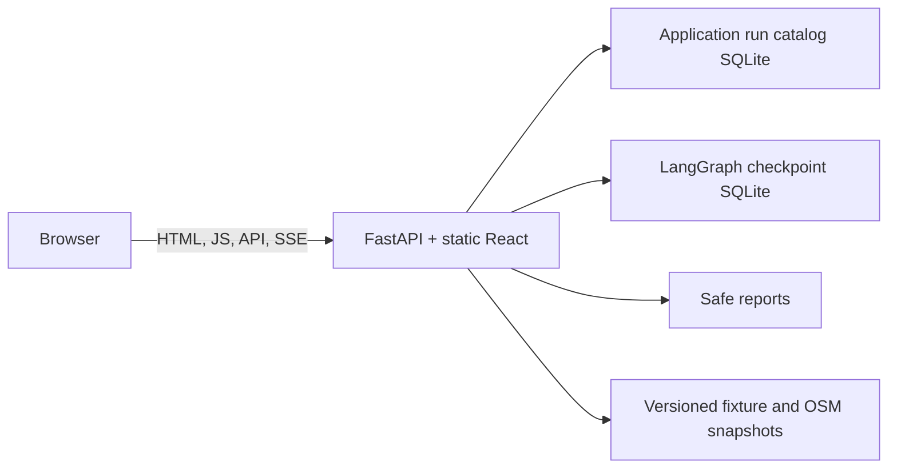

# Phase 4 public demo and Docker deployment

This document packages the London Biodiversity Expedition Planner as one public web service while keeping live data and live model access local and explicit.

## Deployment profiles

Local development advertises all four choices in the request composer: fixture/scripted, live/scripted, fixture/live and live/live. A choice is sent with `POST /api/v1/runs`; FastAPI checks the configured allowlist before any operation is queued. Live model credentials exist only in the FastAPI process environment.

The public profile is intentionally different:

- `BIODIVERSITY_PUBLIC_DEMO=true` requires the allowlist to contain exactly `fixture/scripted`;
- a direct HTTP request for live/scripted, fixture/live or live/live receives a safe `403 mode_not_allowed` response;
- `/docs`, `/redoc` and `/openapi.json` are disabled;
- no API key is included in the image, frontend bundle, events, reports or run catalog;
- the selector remains visible but contains the single permitted mode, so the public behavior is explicit.

## One-container architecture

`Dockerfile` uses a Node build stage for the Vite production bundle and a Python runtime stage for FastAPI. In production the frontend client uses relative `/api/v1` URLs, so React, JSON APIs and SSE share one origin. FastAPI mounts the static build only after all API routers, preserving API routing and SPA fallback behavior.



Build and run the same public profile locally:

```bash
docker compose up --build
```

Then open `http://127.0.0.1:8080`. Compose attaches the named `biodiversity-demo-data` volume at `/var/lib/biodiversity`, preserving the application catalog, LangGraph checkpoints and safe reports across ordinary container restarts.

To stop it:

```bash
docker compose down
```

`docker compose down -v` also deletes the named demo-data volume and its run history; use it only when that deletion is intended.

## Public resource controls

The public demo is unauthenticated, so the application applies small process-local controls before it queues a graph mutation:

| Control | Container default | Behavior |
| --- | ---: | --- |
| Concurrent operations | 2 | Additional mutations receive safe `503 service_busy` |
| Mutations per minute | 20 | Additional mutations receive `429 rate_limited` |
| Stored demo threads | 100 | New starts receive `503 service_busy` at capacity |
| Runtime storage | 192 MB | Mutations stop before the cap is exceeded further |
| Run retention | 24 hours | Inactive threads are deleted through public catalog/checkpointer APIs |
| Cleanup interval | 5 minutes | Startup cleanup plus periodic cleanup |

The limiter is intentionally single-process and the image runs one Uvicorn worker. It is appropriate for this personal fixture demo, not a production multi-tenant service. Cleanup removes the application catalog entries, the corresponding LangGraph thread through the checkpointer's public lifecycle method, and safe operation-report directories. It never edits LangGraph private tables.

## Free Render deployment

`render.yaml` describes a free Docker web service. Connect the GitHub repository in Render, choose **New > Blueprint**, and select this repository. The Blueprint builds the checked-in Dockerfile and uses `/api/v1/health` for health checks.

Free Render services use an ephemeral filesystem, so public-demo SQLite history can disappear on a restart, redeploy or spin-down recovery. This does not affect the local Docker volume. Persistent public history requires a paid persistent disk or an external durable store and is outside this free personal-demo profile.

Do not add a model key to the public service. Public live modes are rejected by code even if a key is accidentally present in the environment.

## Verification

Before publication:

```bash
docker compose build
docker compose up

curl -fsS http://127.0.0.1:8080/api/v1/health
curl -I http://127.0.0.1:8080/docs
```

Verify that health advertises only fixture/scripted, `/docs` is unavailable, a normal fixture run streams ordered SSE events, and a handcrafted live/live request is rejected. The automated Phase 4 API tests exercise the same policy, resource limits, stale-run deletion and same-origin static serving without network access.
