# Phase 4 Visual Product

Phase 4 turns the London Biodiversity Expedition Planner into a local, browser-based product while preserving the deterministic evidence and privacy boundaries established in Phases 1–3. Its core interaction is map + evidence + agent execution + human decisions + time travel. It is not a chat interface.



The diagram is maintained as [Mermaid source](diagrams/phase-4-visual-product.mmd), an SVG, and a PNG rendered at 2× scale.

## Product boundary

The product remains London-only, English-only and birds-first. It presents historical occurrence evidence, not species probability. A server match count is not abundance or a population estimate. It does not guarantee a sighting, site access, opening hours or field success.

Phase 4 does not implement walking routes, route ordering, entrances, walking duration, elevation, habitat suitability, rarity, conservation or legal conclusions, authentication, MCP, runtime Overpass queries, production multi-tenancy, bookings or field actions. Candidate-site geometry comes only from the versioned OSM snapshot. A submitted named start place may use Nominatim Search in live data mode, but that lookup resolves a generalized planning origin and never becomes evidence or routing geometry.

## Architecture

The backend is split into application routes, DTOs, services, repositories and the SSE adapter under `app/biodiversity/api/`.

- `BiodiversityRunManager` remains the only LangGraph run, checkpoint and time-travel boundary.
- FastAPI accepts and returns Pydantic application DTOs. Endpoints never serialize a raw `StateSnapshot`.
- Every start, resume, replay and fork is queued and returns `202 Accepted` with an operation identity. The graph mutation runs through `asyncio.to_thread`, so it cannot block the event loop.
- The coordinator serializes mutations for the same thread while allowing independent threads to execute concurrently. Disconnecting an SSE client does not cancel a mutation.
- The LangGraph SQLite checkpointer and the application-owned SQLite run catalog have independent schemas. The catalog never inspects private checkpointer tables.
- `AgentRunEvent`, `AgentRunRecorder` and `InMemoryAgentEventBroker` are the Phase 3 event contracts. Phase 4 adds only an SSE transport over them.
- Safe operation reports preserve completed event streams for refresh and restart. The in-memory broker is only the live, single-process delivery mechanism.
- Named-place resolution is a separate repository boundary. Fixture mode loads a versioned, sanitized real Nominatim response; live data mode performs one bounded, rate-limited search only after submission. The graph stores the coordinate internally, while the application DTO exposes only a response-local candidate ID, label, locality, district, postcode and place type.

The React application is decomposed into the request composer, status header, run lineage navigation, MapLibre evidence map, plan/evidence/weather cards, typed HITL decisions, live trace, checkpoint inspector and time-travel comparison. `src/api/schema.d.ts` is generated from the checked-in FastAPI OpenAPI document and the hand-written client references those generated types.

## API contract

All routes are under `/api/v1`:

| Method | Route | Purpose |
| --- | --- | --- |
| GET | `/health` | Product, workflow and default mode status |
| POST | `/runs` | Queue a new expedition |
| GET | `/runs` | List durable run summaries |
| GET | `/runs/{thread_id}` | Read a run, operations, branches, executions, decisions and current safe plan |
| GET | `/runs/{thread_id}/history` | Read checkpoint, branch and execution identities |
| GET | `/runs/{thread_id}/checkpoints/{checkpoint_id}/state` | Read the exact Phase 3 `StateView`; requires matching `node_id` and `graph_step` |
| GET | `/runs/{thread_id}/checkpoints/{checkpoint_id}/evidence` | Read safe counts, quality, provenance, constraints and daily weather |
| GET | `/runs/{thread_id}/checkpoints/{checkpoint_id}/map` | Read publishable aggregate cells and selected snapshot site polygons |
| POST | `/runs/{thread_id}/resume` | Validate a typed decision and queue resume |
| POST | `/runs/{thread_id}/replay` | Queue downstream replay from a non-terminal checkpoint |
| POST | `/runs/{thread_id}/fork` | Validate allow-listed constraint changes and queue a new branch |
| GET | `/runs/{thread_id}/compare` | Return deterministic `PlanComparison` for two exact checkpoints |
| GET | `/operations/{operation_id}` | Read durable operation status |
| GET | `/operations/{operation_id}/events` | Replay and stream safe lifecycle events with SSE |

Mutation status is `queued`, `running`, `waiting_for_input`, `completed` or `failed`. An operation that reaches a HITL interrupt finishes as `waiting_for_input`; a later request creates a new resume operation on the same thread.

Errors have one shape:

```json
{
  "error": {
    "code": "invalid_operation",
    "message": "The requested checkpoint operation is invalid.",
    "fields": []
  }
}
```

The API uses 404 for missing runs/checkpoints/operations, 409 for identity or mutation conflicts, 422 for invalid updates or decisions, 503 for unavailable configured runtimes, and a sanitized 500 fallback. Validation errors report field paths, never rejected values or raw exception text.

The OpenAPI source of truth is [phase-4-openapi.json](phase-4-openapi.json). Regenerate it and the TypeScript projection with:

```bash
python -m scripts.export_phase4_openapi
cd frontend
npm run api:types
```

## Run catalog and durability

`SQLiteRunCatalog` stores only operation/run identity and lifecycle metadata:

- operation ID, thread ID, branch ID and execution ID;
- operation kind;
- status and created/started/finished timestamps;
- last event sequence and current checkpoint ID;
- safe report-directory reference;
- non-secret data/model mode and sanitized failure code.

It does not copy request prompts, graph state, event payloads, tool values or credentials. On application restart, queued/running process-local operations are marked failed with `service_restarted`; completed and waiting runs remain discoverable through the catalog and durable checkpointer.

## SSE behavior

The event stream uses each `AgentRunEvent.sequence` as its SSE `id`. A client may pass `Last-Event-ID` or `after_sequence`; the server replays only larger sequence numbers and then waits for live events. A comment heartbeat is emitted approximately every 15 seconds when no event arrives. The stream ends after the terminal event has been delivered.

Responses use `text/event-stream`, `Cache-Control: no-cache, no-transform` and `X-Accel-Buffering: no`. The frontend reconnects from its last accepted sequence and suppresses duplicates. Closing the browser only closes the subscription.

SSE payloads contain lifecycle identity, timing, node/tool/model labels and safe checkpoint linkage. They contain no prompt, raw state, tool input/output, occurrence coordinate or occurrence identifier.

## DTO and privacy boundary

`StateView` is the allow-listed Phase 3 view. A state request must supply an exact five-part identity: thread, branch and execution are verified from the selected checkpoint, while `checkpoint_id`, `node_id` and `graph_step` must match exactly. Timestamp proximity is never used.

`EvidenceView` contains bounded counts, deterministic outcome, diversity/quality summaries, warnings, seasonal/year windows, safe plan-site metadata, deterministic constraints, exact-date daily weather and provenance. It never returns `ExpeditionEvidenceBundle` directly.

`MapEvidenceView` applies an additional boundary:

- aggregate grid polygons are returned only for `strong_map_evidence`;
- response-local IDs such as `grid-01` replace internal safe-cell identities;
- density and dataset diversity are deterministic bands, not raw associations;
- individual occurrence coordinates, occurrence IDs, record references, HMACs and site-to-cell associations are absent;
- only candidate/contextual site IDs already selected in the exact checkpoint are looked up in the versioned OSM snapshot;
- only OSM Polygon/MultiPolygon geometry is returned; the complete 3,364-feature snapshot is never sent;
- the start context is rounded to approximately 0.01 degrees and labelled as generalised.

The typed location-correction view is stricter still: Nominatim `place_id`, OSM object IDs, bounding boxes, query URLs and coordinates are omitted. Roads often have multiple OSM segments, so the application never silently treats the first search result as the user's intent. The user selects an offered response-local candidate ID or provides a postcode; the server then maps that choice back to the exact internal candidate and verifies the point against the versioned Greater London boundary.

Every map includes OpenStreetMap, GBIF and Open-Meteo attribution plus the historical-evidence, no-guarantee, access and straight-line-distance limitations. With no configured basemap, the local paper style, overlays, text ledger, legend and error/empty states remain usable.

## Model decisions and deterministic validation

| The model may decide | Deterministic code remains authoritative for |
| --- | --- |
| Parse an English request into a typed draft | Required fields, date/duration ranges and London-only request rules |
| Extract the user's named-place wording | Nominatim query bounds, returned candidates, Greater London point-in-polygon validation and exact offered-candidate selection |
| Propose the next approved evidence tool call | Tool allowlist, bounded loops, deduplication, coordinate quality and evidence thresholds |
| Compose a structured plan from the evidence bundle | Strong-evidence gate, candidate/site-cell grounding, contextual-site separation and limitation wording |
| Revise a draft once after grounding feedback | Final schema, provenance, no-prediction/no-route boundary and deterministic fallback |
| Present candidate taxa for human selection | Candidate identity, bird classification and exact offered-choice validation |

Human input is also constrained. The browser renders dedicated forms for clarification, location correction, bird correction, taxon selection, actionable trade-offs and related-taxon selection. The API and `BiodiversityRunManager` validate the selected checkpoint, interrupt kind, offered option and allowed fields before queuing a resume.

## Local operation

Python 3.10+ and Node.js 20+ are recommended.

```bash
python -m venv .venv
source .venv/bin/activate
python -m pip install --upgrade pip
python -m pip install -r requirements.txt

cd frontend
npm ci
cd ..
```

Start the API from the repository root:

```bash
python -m uvicorn app.biodiversity.api.main:app \
  --host 127.0.0.1 \
  --port 8000
```

In a second terminal, start the frontend:

```bash
cd frontend
npm run dev
```

Open `http://127.0.0.1:5173`, select **Strong evidence**, choose a run mode, and select **Start expedition**. The default fixture/scripted mode needs no network or API key. Local development advertises all four modes through the health endpoint; the API remains authoritative and rejects any mode outside its configured allowlist.

Configuration stays server-side unless prefixed `VITE_` below:

| Variable | Default | Purpose |
| --- | --- | --- |
| `BIODIVERSITY_CHECKPOINT_DB` | `data/runtime/biodiversity-checkpoints.sqlite` | Durable LangGraph checkpoints |
| `BIODIVERSITY_RUN_CATALOG_DB` | `data/runtime/phase4-run-catalog.sqlite` | Application run catalog |
| `BIODIVERSITY_REPORT_ROOT` | `reports/runs/phase4` | Safe operation reports |
| `BIODIVERSITY_CORS_ORIGINS` | localhost Vite origins | Explicit comma-separated browser origins; wildcard is rejected |
| `BIODIVERSITY_DATA_MODE` | `fixture` | Default health/display mode |
| `BIODIVERSITY_MODEL_MODE` | `scripted` | Default health/display mode |
| `BIODIVERSITY_ALLOWED_RUN_MODES` | all four locally | Comma-separated server allowlist such as `fixture/scripted,live/live` |
| `BIODIVERSITY_PUBLIC_DEMO` | `false` | Locks the service to fixture/scripted and requires public resource limits |
| `BIODIVERSITY_SERVE_FRONTEND` | `false` | Serve a built `frontend/dist` from the FastAPI origin |
| `BIODIVERSITY_EXPOSE_API_DOCS` | `true` locally | Enable `/docs`, `/redoc`, and `/openapi.json`; forced off in public-demo mode |
| `BIODIVERSITY_SSE_HEARTBEAT_SECONDS` | `15` | Idle SSE heartbeat interval |
| `OPENAI_API_KEY`, `OPENAI_MODEL`, `OPENAI_BASE_URL` | unset | Opt-in live model runtime; never returned to the browser |
| `VITE_API_BASE_URL` | same origin | Optional public API origin |
| `VITE_MAP_STYLE_URL` | local empty style | Optional public MapLibre style URL; must not contain a secret token |

FastAPI and Vite bind to `127.0.0.1` in the documented development flow. To use fixture/live or live/live, export `OPENAI_API_KEY` and `OPENAI_MODEL` (and optionally `OPENAI_BASE_URL`) before starting FastAPI, then choose that mode in the browser. Do not put paid map tokens or model credentials in any `VITE_` variable.

## Four run modes

| Data | Model | Intended use | Default tests |
| --- | --- | --- | --- |
| fixture | scripted | CI, unit tests, full E2E and demonstrations | Yes |
| live | scripted | Opt-in current upstream data with deterministic model behavior | No |
| fixture | live | Opt-in model integration over stable fixtures | No |
| live | live | Opt-in end-to-end external integration | No |

The local Phase 4 UI can initiate any mode advertised by the server. Default tests and the public deployment initiate only fixture/scripted; live checks retain the explicit opt-in rules documented for earlier phases.

### Named-place data source

`fixture/scripted` and `fixture/live` read the checked-in `nominatim-london-places.json` snapshot. Its Kensal Road candidates came from a real bounded Nominatim response, but are fixed so tests remain offline. `live/scripted` and `live/live` query the current Nominatim Search API after the user submits a run. They do not query on each keystroke.

The OpenStreetMap Foundation public Nominatim endpoint does not require an API key and permits low-volume use under its usage policy; it is nevertheless rate-limited and carries no availability guarantee. The implementation caps results at three, supplies an identifying User-Agent, serializes requests to at most one request per second, preserves `© OpenStreetMap contributors` and ODbL attribution, and turns source failure into a safe postcode alternative. This makes it appropriate for a personal local demonstration, not an unbounded public production deployment.

The single-container and public safety design is documented in [the Phase 4 public demo guide](phase-4-public-demo.md).

## Verification

```bash
python -m pytest -m 'not live' -q
python -m pytest -q tests/test_biodiversity_phase4_api.py
python -m ruff check .
python -m compileall -q app scripts tests

cd frontend
npm run lint
npm run typecheck
npm test -- --run
npm run build
npm run test:e2e

cd ..
git diff --check
```

The Playwright suite starts a fixture/scripted backend with temporary SQLite/report paths and does not use public tiles. It covers a strong Common woodpigeon plan, robin taxonomy HITL, Common swift low-evidence acceptance, and a constraint fork with deterministic comparison. Unit tests mock MapLibre rendering; no frontend test automatically starts a live data or live model mode.

## Visual QA checklist

Browser acceptance uses a 1440×900 desktop viewport and a 390×844 mobile viewport. Check the strong plan, taxonomy HITL, low-evidence plan, checkpoint comparison and a stopped-API/source-error presentation. Confirm keyboard focus, accessible names, text alternatives for map contents, non-color status labels, responsive reflow, readable overflow, and the absence of secrets or occurrence-level data.
