# Entrances and journey validation

[Documentation](README.md) · [Evidence and grounding](evidence-and-grounding.md)

The route pipeline turns a directly grounded birdwatching site into a constrained outing. The default live profile uses TfL public transport plus walking; the reproducible fixture profile uses saved walking routes. Internal `WalkingRoute*` and `request_walking_routes` identifiers are retained, but do not imply that every live journey is walking-only.

## Deterministic route pipeline

1. Resolve audited OSM entrances for directly grounded sites only.
2. Request journeys for at most the first three evidence-ordered candidates, using the planning origin and a mapped entrance.
3. Obtain outbound and return journeys separately. Never assume that the return duplicates the outbound.
4. Validate entrance approach, access certainty, walking distance and the complete outing duration.
5. Rank eligible options using stable code-defined ordering: access certainty, complete travel time, walking distance, evidence-site order and stable identities.
6. Offer a typed route trade-off only when a human decision can change the result.
7. Supply the selected facts to the composer and verify that its explanation preserves them.

Low evidence, missing grounded sites and entrance-source failures do not trigger route-provider calls. Missing entrances, unavailable routes or failed constraints return typed safe outcomes, not synthetic routes.

## Entrance evidence

Runtime uses the versioned [entrance snapshot](../data/osm/london-public-green-space-entrances-2026-09-04.geojson), with provenance and a checksum. It joins entrances to auditable OSM site identities and excludes prohibited/private access, prohibited foot access and service, emergency or exit-only entries. Explicit public access ranks ahead of unspecified access; missing tags are not proof of public access.

The implementation does not invent an entrance from a polygon centroid, an interior point or the nearest road. The snapshot is a small audited demonstration subset, not complete London coverage. A mapped gate does not establish current opening or legal access, so field checks remain necessary.

Normal runtime never calls Overpass. Snapshot refresh is a separate, explicit data-maintenance operation.

## Constraint semantics

| Field | Meaning |
| --- | --- |
| `search_radius_km` | Projected candidate-site search radius, not a route-distance promise |
| `maximum_walking_distance_km` | Total walking distance across outbound and return journeys, not public-transport distance |
| `duration_hours` | Complete outing budget, including all outbound and return travel |
| Remaining field time | Outing duration minus complete travel duration; it must remain positive |

The model cannot select a different route, recalculate totals or invent directions. Provider legs and manoeuvres supply journey instructions. Deterministic validation also controls elevation availability, provenance, limitations and the complete fallback plan. See [route semantics](adr/0001-routing-semantics.md).

## Providers and storage

Fixture routing makes no live requests. Live routing defaults to `TfLJourneyProvider` and does not silently fall back to fixtures or switch to walking-only. OpenRouteService and GraphHopper adapters remain available for an explicitly configured walking-only chain; they are not prerequisites for the default fixture or TfL profile.

Provider credentials are backend-only. Cache keys include provider/version, route profile/schema, journey inputs and routing options. Cache and exact geometry are stored under the gitignored route-runtime directory, configurable with `BIODIVERSITY_ROUTE_RUNTIME`. They do not contain API keys.

Occurrence coordinates and safe-cell coordinates are never route endpoints. Exact geometry is served through a checkpoint-specific API reference; public-demo geometry is restricted to the planned non-private fixture origin. Generic state, SSE events and safe reports omit geometry and private precise origins. See [provider policy](adr/0003-routing-provider-failover.md) and [route privacy](adr/0004-route-privacy.md).

## Map and observability

MapLibre renders evidence cells, candidate polygons, the generalised start, selected entrance and journey geometry as aligned layers. The backend supplies the OpenFreeMap style and a restricted resource-origin allowlist. `BIODIVERSITY_BASEMAP_STYLE_URL=disabled` selects an overlay-only map; a failed basemap also preserves the evidence overlays. Attribution remains visible. See [basemap delivery](adr/0002-basemap.md).

Entrance resolution, provider attempts, cache hits, validation, ranking and route decisions produce typed lifecycle events. Safe reports include `route-audit.json`, `route-plan.json` and `provider-cache-timings.json`, alongside node/model/tool/provider timing spans.

Route-affecting changes invalidate prior route evidence. Historical checkpoint compatibility is defined in [ADR 0005](adr/0005-workflow-version-compatibility.md). Verification commands and opt-in live tests are described in [verification](verification.md).
